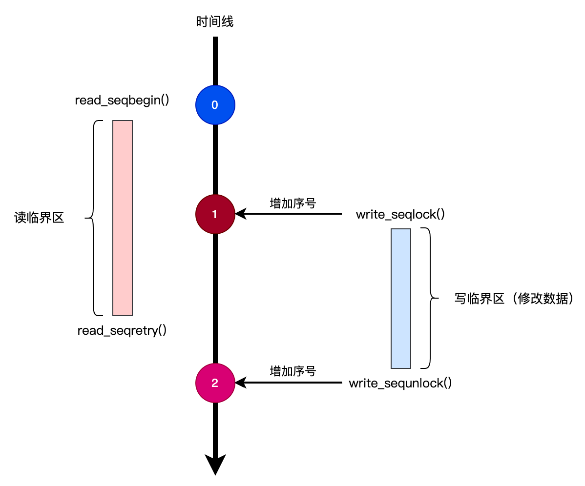

Linux 内核有非常多的锁机制，如：自旋锁、读写锁、信号量和 RCU 锁等。本文介绍一种和读写锁比较相似的锁机制：顺序锁（seqlock）。

顺序锁与读写锁一样，都是针对多读少写且快速处理的锁机制。而顺序锁和读写锁的区别就在于：读写锁的读锁会阻塞写锁，而顺序锁的读锁不会阻塞写锁。

## 读锁原理

为了让读锁不阻塞写锁，读锁并不会真正进行上锁操作。那么读锁是如何避免在读取临界区数据时，数据被其他进程修改了？

为了解决这个问题，顺序锁使用了一种类似于版本号的机制：`序号`。序号是一个只增不减的计数器，可以从顺序锁对象的定义看出，如下代码所示：

```c
typedef struct {
     struct seqcount seqcount; // 序号
     spinlock_t lock;          // 自旋锁，写锁上锁时使用
} seqlock_t;
```

在读取临界区数据前，首先需要调用 `read_seqbegin()` 函数来获取读锁，`read_seqbegin()` 函数的核心逻辑是读取顺序锁的序号。代码如下所示：

```c
static inline unsigned read_seqbegin(const seqlock_t *sl)
{
    unsigned ret;

repeat:
    // 读取顺序锁的序号
    ret = sl->sequence;

    // 如果序号是单数，需要重新获取
    if (unlikely(ret & 1)) {
        ...
        goto repeat;
    }
    ...
    return ret;
}
```

从上面的代码可以看出，`read_seqbegin()` 函数只获取顺序锁的序号，并不会进行上锁操作，所以读锁并不会阻塞写锁。

> 注意：序号是单数时需要重新获取的原因，会在分析写锁实现原理时说明。

既然读锁并不会进行上锁操作，如果在读取临界区数据时，数据被修改了怎么办呢？答案就是：在退出临界区时，比较一下当前顺序锁的序号跟之前读取的序号是否一致。如果一致表示数据没有被修改，否则说明数据已经被修改。如果数据被修改了，那么需要重新读取临界区的数据。

比较序号是否一致可以使用 `read_seqretry()` 函数，所以读锁的正确用法如下代码所示：

```c
do {
    // 获取顺序锁序号
    unsigned seq = read_seqbegin(&seqlock);
    // 读取临界区数据
    ...
} while (read_seqretry(&seqlock, seq)); // 对比序号是否一致?
```

`read_seqretry()` 函数的实现非常简单，如下所示：

```c
static inline unsigned 
read_seqretry(const seqlock_t *sl, unsigned start)
{
    ...
    return sl->sequence != start;
}
```

从上面代码可以看出，`read_seqretry()` 函数只是简单比较当前序号与之前读取到的序号是否一致。

## 写锁原理

从上面的分析可知，读锁是通过对比前后序号是否一致来判断数据是否被修改的。那么序号在什么时候被修改呢？答案就是：获取写锁时。

获取写锁是通过 `write_seqlock()` 函数来实现的，其实现也比较简单，代码如下所示：

```c
static inline void write_seqlock(seqlock_t *sl)
{
    spin_lock(&sl->lock);

    sl->sequence++;
    ...
}
```

`write_seqlock()` 函数首先会获取自旋锁（所以写锁与写锁之间是互斥的），然后对序号进行加一操作。所以，在修改临界区数据前，写锁先会增加序号的值，这样就会导致读锁前后两次获取的序号不一致。我们可以用下图来说明这种情况：



可以看出，当在读临界区前后获取的序号值不一致时，就表示数据已经被修改，这时就需要重新读取被修改后的数据。

写锁解锁也很简单，代码如下：

```c
static inline void write_sequnlock(seqlock_t *sl)
{
  ...
	s->sequence++;
	spin_unlock(&sl->lock);
}
```

解锁也需要对序号进行加一操作，然后释放自旋锁。

由于 `write_seqlock()` 函数与 `write_sequnlock()` 函数都会对序号进行加一操作，所以解锁后，序号的值必定为双数。

我们在分析读锁时看到，如果序号是单数时会重新获取序号，直到序号为双数为止。这是因为序号单数时，表示正在更新数据。此时读取临界区的值是没有意义的，所以需要等到更新完毕再读取。

